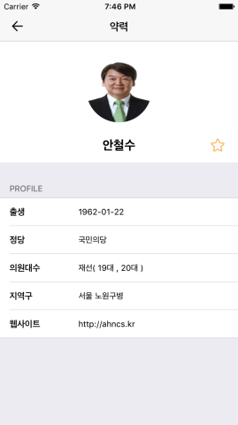

# OpenNA
This is an application that provides information about lawmakers, bills and parties in Korea. Users can check not only the profile and activity of each lawmaker in their constituency, but also what kind of bills they propose and how the bills affects the lives of citizens.

# Features 

* Once the application launches, users can see a list of lawmaker's information with lawmakers' names and the parties they belong to. It lists all incumbent lawmakers who were elected during the 20th general election held in South Korea. On the right side of the list, there are indexes that enable users to find lawmakers easily based on the first letter of each lawmaker's family name. 

* If users tap the 'Bill' tab on the menu, they can see a list of bill information which is arranged in chronological order. Each card-like item listed contains the title of the bill, the names of the lawmakers who proposed the bill and which stage this bill is at in the National Assembly's legislation-making process. Moreover, the more they scroll through the list, the more bill information will become available. 

* The last tab on the menu, 'Party', displays a list of parties which have existed in South Korea from when the National Assembly was established back in 1948. When a party logo image is selected, the screen moves to the Wikipedia page for the selected party.

* At the bottom of the screen there are three menu tabs: 'Politics', 'Favourites' and 'Search'. The 'Politics' tab is selected as the default setting, and as described above, it includes three different submenus: 'Lawmaker', 'Bill' and 'Party'. These show lists of information corresponding to each category. The 'Favourites' tab shows 'Lawmaker' and 'Bill' lists that users have marked as their favourites. The 'Search' tab allows users to search for information.


  

* When users select a lawmaker, they can see detailed information of the lawmaker which includes 'Birth', 'Party', 'In Office', 'District' and 'Homepage'. In addition, there is a heart-shaped button on the right side and if users push this button, the color of the button is changed immediately as red color and the lawmaker information is saved. Lawmakers marked as favourite can be checked later in 'Favorites' menu on the bottom Tabbar menu. 

* Detailed information of the selected bill is also provided, as you can see the images below. It includes 'Assembly session', 'Proposed date', 'Status', 'Summary', and so on. If the 'External links' menu is tapped, the original bill document with pdf format is displayed so that users are able to see every detail of the bill. Bill information can also be saved by clicking the heart-shaped button on the top right of the screen and can be seen later in 'Favourites' menu on the bottom Tabbar menu. 


* As I briefly stated above, party information is available when users can tap the logo image of the party.




The images below show lists of lawmakers and bills that I saved based on my own interest. It is in this way, that users can save any information about lawmakers and bills that they are interested in and want to save.


Finally, this application provides a 'Search' function, so that users are able to search lawmaker, bill and party information. In the top of the screen, users can type any search keyword they want and see the results of the search operation right away on the list below.


# Open Source Licence

This project uses open source library. Thanks for the developers who are dedicated to developing great open source library. 

*  [TeamPopong API](http://data.popong.com/)
*  [Alamofire](https://github.com/Alamofire/Alamofire)
*  [AlamofireImage](https://github.com/Alamofire/AlamofireImage)
*  [MBProgressHUD](https://github.com/jdg/MBProgressHUD)

# Image Licence 

This project uses icons from Icons8. Thank [Icons8](https://icons8.com/) for your hard work. 

# How to build 

1) Clone the repository 

```
$ git clone https://github.com/woogii/OpenNA.git
$ cd OpenNA
```
2) Open the workspace in XCode 

```
$ open OpenNA.xcodeproj/
```
3) Set up the third party library 

```
$ pod install
```

4) Compile and run the app in your simulator 

# Compatibility 
The code of this project works in Swift3.0, Xcode 8.2.1 and iOS9 
